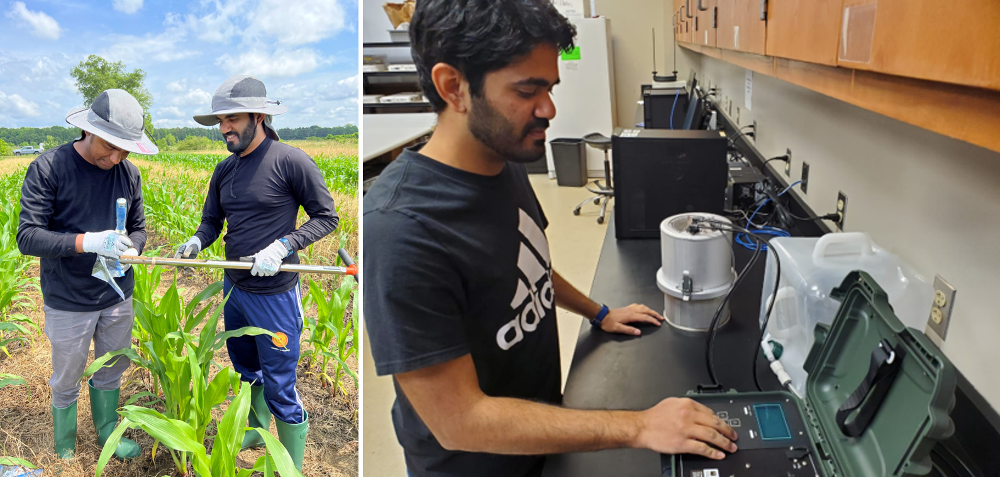

I am a current Ph.D. student in Biological Engineering at [Advanced Plant and Soil Sensing Lab](https://apsslab.abe.msstate.edu/), at the Mississippi State University, USA.

## Contents
* [Education](#education)
* [Working Experience](#working-experience)
* [Research Projects](#research-projects)
* [Publications](#publications)

## Education
* 2022 - 2025  
    Ph.D. in Biological Engineering  
    Department of Agricultural & Biological Engineering  
    James Worth Bagley College of Engineering  
    Mississippi State University, MS, USA
* 2020 - 2021  
    MBA in General  
    Cardiff Metropolitan University, United Kingdom
* 2017 - 2019  
    M.Sc. in Agricultural & Biosystems Engineering  
    Department of Agriculture Engineering  
    Postgraduate Institute of Agriculture  
    University of Peradeniya, Sri Lanka
* 2013 - 2016  
    B.Sc. in Agricultural Technology & Management  
    Department of Agriculture Engineering  
    Faculty of Agriculture  
    University of Peradeniya, Sri Lanka

[back to contents](#contents)

## Working Experience

### 2021 September – 2021 December
    Consultant Field Manager
    Janathakshan (Guarantee) Limited
    Colombo 05, Sri Lanka

I was worked with Janathakshan Ltd. at the end this project. Under this project, the permanent and temporary economic displacements to more than 800 persons engaged in a variety of commercial business activities of different scales as well as for those employed in different business establishments in Good Shed Bus Stand have been foreseen in the Livelihood Restoration Plan of Kandy Multimodal Transport Terminal. Livelihood Restoration Plan was based on four strategic directions phasing-out, relocation, re-employment and transformation. Kandy Multimodal Transport Terminal (KMTT) will be established in the site of the previously Good Shed Bus Stand as an integrated modern transport terminal linking public, private bus services and railway services. The KMTT is designed to contribute towards the goal of relieving traffic congestion in the World-Heritage city of Kandy, central province of Sri Lanka. 

Kandy Multimodal Transport Terminal [[website](https://www.scdp.lk/kmtt_kandy)]

### 2019 January – 2021 September
    Consultant/ Research Assistant
    Waste to Energy Technologies Limited
    Battaramulla, Sri Lanka

I completed multiple projects and research work during my stay at the Waste to Energy Technologies Ltd. The key works completed during the stay are listed below.

* Preparation of Preliminary Environmental Appraisal for proposed design and construction of housing units in Sri Lanka
* Survey on healthcare waste generation in Western Province of Sri Lanka, a project for the formulation of Western Province Solid Waste Management Master Plan, Sri Lanka
* Development of plan and guideline for value addition to spent yeast at Lion Brewery (Ceylon) PLC, Sri Lanka
* Development of landfill rehabilitation plans for major dumpsites of Sri Lanka
* Development of manure and nutrient management plan for modernized dairy farm facilities in Ambewela farm complex
* Analysis of Polychlorinated Biphenyls under the project on Enabling Activities to Review and Update the National Implementation Plan of the Stockholm Conventional on Persistent Organic Pollutants in Sri Lanka
* Site visits, data collection and report writing for case study reports on best practices in plastic recycling, municipal waste composting, and segregated waste collection
* Root testing and modeling effects of vegetation in improving slope stability, under the project of Nature-Based and Hybrid Solutions for landslide risk management in Sri Lanka
* Assessment of waste management needs and solid waste management solutions for both Nuwaraeliya and Ambagamuwa areas
* Conducted a labor satisfaction survey in the Solid Waste Management Unit at Ratnapura Municipal Council, Sri Lanka
*Laboratory testing of the materials used for installation of Permeable Reactive Barrier (PRB) system for groundwater remediation at Sundarapora disposal site in Kurunegala Municipal Council, Sri Lanka

### 2017 June - 2018 November
    Project Coordinator
    EX Research Institute Limited
    Tokyo, Japan

I was engaged in two different projects with the Japanese company called EX Research Institute Limited.

The first project was to Assist a feasibility study on the construction of a system for collection and treatment of used fluorocarbons to introduce energy-saving equipment with natural or low global warming potential refrigerants in Sri Lanka

The second project was to assist a pilot project of 3Rs (Reduce, Reuse, Recycle) promotion in Ratnapura Municipal Council under the project of Pollution Control and Reduction of Environmental Burden in Solid Waste Management in Sri Lanka [[paper](https://digital.detritusjournal.com/articles/evaluation-of-organic-and-recyclable-waste-separation-at-generation-source-in-ratnapura-and-kataragama-local-authorities-in-sri-lanka/359)]

### 2017 March – 2017 July
    Intern - Research Division
    International Water Management Institute
    Battaramulla, Sri Lanka

I was worked as a research intern for the case study "Mechanizing Water Lifting through Pumps" in Sri Lanka. The main aim of the case study was to identify and analyze the trajectories of technological innovations and adoption for agricultural water management in farming systems in Sri Lanka, with a special focus on identifying positive and negative impacts, emerging issues, and potential responses for the rapid proliferation of motor pumps for intensification of agriculture [[paper](https://www.iwmi.cgiar.org/publications/iwmi-working-papers/iwmi-working-paper-188/)]

[back to contents](#contents)

## Research Projects
### Comparison of Vis-NIR and MIR Spectroscopy for Estimation of Total Carbon and Nitrogen using a Mississippi Soil Dataset

Reflectance spectroscopy in the visible and near-infrared (vis-NIR) and mid-infrared (MIR) ranges has emerged as a promising tool for quantitative soil analysis, with the potential to replace or complement the traditional lab-based wet-chemical analysis of certain soil properties. The goal of this study was to examine the accuracy of total carbon (TC) and total nitrogen (TN) estimation using vis-NIR and MIR spectroscopy for Mississippi soil. The vis-NIR reflectance spectra of the samples were measured using an ASD LabSpec 4 spectrometer with an attached muglight accessory. Attenuated Total Reflectance (ATR) and Diffuse Reflectance Infrared Fourier Transform (DRIFT) spectra for all samples were acquired using a Bruker Alpha II spectrometer in the MIR range. According to the PLSR analyses, MIR spectra were more effective at predicting TC and TN of soils compared to vis-NIR reflectance spectra.

<!--  -->
<!--  -->

**Key notes**
* The first few studies conducted for soil property estimation using spectroscopy for Mississippi soils
* Comparison of Vis-NIR and MIR Spectroscopy 
* Estination of total carbon and total nitrogen in soil

### Use of Mid-infrared Spectroscopy for Hydrological Soil Property Estimation in Mississippi and Texas

Mid-infrared (MIR) spectroscopy has emerged as a rapid measurement technique that has the potential to complement if not substitute laboratory analysis of soil properties. Mid-infrared spectroscopy has been successfully used for estimating dynamic soil properties (DSP): moisture, organic carbon, cation exchange capacity, electrical conductivity, and pH. However, there are scanty or no reports on hydrological soil properties (HSP): infiltration, soil hydraulic conductivity, water retention, and available water capacity. In addition, the available conventional methods of measuring hydrological soil properties are labor-intensive and time-consuming. The goal of this project is to enable Natural Resources Conservation Service field offices in Texas and Mississippi to utilize MIR spectroscopy to derive DSPs and HSPs in office without performing laborious and costly conventional field or laboratory measurements.

<!-- **Key notes** -->
<!-- * Jetson TX2 as the onboard computer -->
<!-- * In-house developed geometric decoupled-yaw controller [[paper](https://doi.org/10.23919/ACC.2019.8815189)] -->
<!-- * Same custom-developed hardware/software system as the UAV used in [Autonomous Landing]#(#autonomous-landing-of-a-uav-on-a-moving-ship) project -->

[back to contents](#contents)

## Publications

Below is my current published research work.
For most up-to-date version, please visit my [Google Scholar page](https://scholar.google.com/citations?view_op=list_works&hl=en&hl=en&user=5Ftw3bwAAAAJ).

* Karunarathna, A., Gamagedara, Y., Mannapperuma, N., Ariyawansha, R. and Basnayake, B.F.A., (2018): Development of a Methane (CH4) Surface Emission Map: A Case Study at Karadiyana Dumpsite, Sri Lanka, APLAS TOKYO 2018, The 10th Asia-Pacific Landfill Symposium (Japan), 24 – 26, November 2018, pp 291-296. [[paper](https://www.researchgate.net/publication/330290073_The_10th_Asia-Pacific_Landfill_Symposium_APLAS_TOKYO_2018_DEVELOPMENT_OF_A_METHANE_CH_4_SURFACE_EMISSION_MAP_A_CASE_STUDY_AT_KARADIYANA_DUMP_SITE_SRI_LANKA)]

* Aheeyar, M., Manthrithilake, H., Ranasinghe, C., Rengaraj, M., Gamagedara, Y. and Barron, J., (2019): Mechanizing Water Lifting through Pumps: A Case Study in Sri Lanka: International Water Management Institute (IWMI). 61p. (IWMI Working Paper 188). doi: 10.5337/2019.206. [[paper](https://www.iwmi.cgiar.org/publications/iwmi-working-papers/iwmi-working-paper-188/)]

* Gamagedara K.Y.B., Alahakoon A.M.Y.W. Karunarathna A.K., Kirindage K.G.I.S. and Attanayake C. P., (2019): Thermo-Pyrolysis Conversion of Sewage Sludge into Biochar and its Characterization, Proceedings of Peradeniya University International Research Sessions (iPURSE 2019), Volume 22, pp 50.

* Gamage H.G.V.D., Karunarathna A.K. and Gamagedara K.Y.B., (2020): Test of Root Tensile Strength of Candidate Plant Species for Soil Bioengineering in Shallow Landslides, Proceedings of the 6th Faculty of Agriculture Undergraduate Research Symposium (FAuRS 2019) held in Faculty of Agriculture, University of Peradeniya, Peradeniya, Sri Lanka, 16th July 2020. pp 205.

* Anurudda Karunarathna, Thilini Rajapaksha, Yasas Gamagedara, Shenal Kaldera, and Nadeesha Vidanage, (2020): Effective Plastic Waste Management, in Sri Lanka, IGES Centre Collaborating with UNEP on Environmental Technologies (CCET). [[paper](https://www.ccet.jp/publications/effective-plastic-waste-management-sri-lanka)]

* Anurudda Karunarathna, Thilini Rajapaksha, Yasas Gamagedara, Shenal Kaldera, and Nadeesha Vidanage, (2020): Towards Sustainable Operation and Management of Centralized Composting in Sri Lanka, IGES Centre Collaborating with UNEP on Environmental Technologies (CCET). [[paper](https://www.ccet.jp/publications/towards-sustainable-operation-and-management-centralized-composting-sri-lanka)]

* Anurudda Karunarathna, Thilini Rajapaksha, Yasas Gamagedara, Shenal Kaldera, and Nadeesha Vidanage, (2021): Challenges and Opportunities of Source-Segregated Waste Collection in Sri Lanka, IGES Centre Collaborating with UNEP on Environmental Technologies (CCET). [[paper](https://www.ccet.jp/publications/challenges-and-opportunities-source-segregated-waste-collection-sri-lanka)]

<!-- Geometric Adaptive controls of a quadrotor UAV with decoupled attitude dynamics, K Gamagedara, T Lee, DOI: [10.1115/1.4052714](https://doi.org/10.1115/1.4052714){:target="_blank"} -->

[back to contents](#contents)
